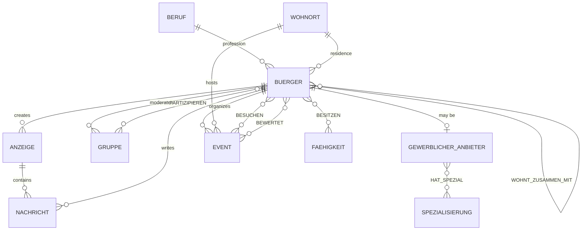

# Database Model

The project models a small community platform. The conceptual design was translated into a relational SQLite schema with 16 tables, foreign-key relationships, composite keys, checks and database triggers.

## Main relationships

## Integrity rules

Some constraints are expressed directly through keys and `CHECK` clauses, while rules that span multiple rows/tables are enforced with SQLite triggers.

Examples:

- an event can only be rated by a citizen who attended it
- a citizen can belong to at most two private groups
- an advertisement with associated messages cannot be deleted
- a group is limited to a maximum number of members

The complete executable schema is available in [`schema.sql`](../schema.sql).
